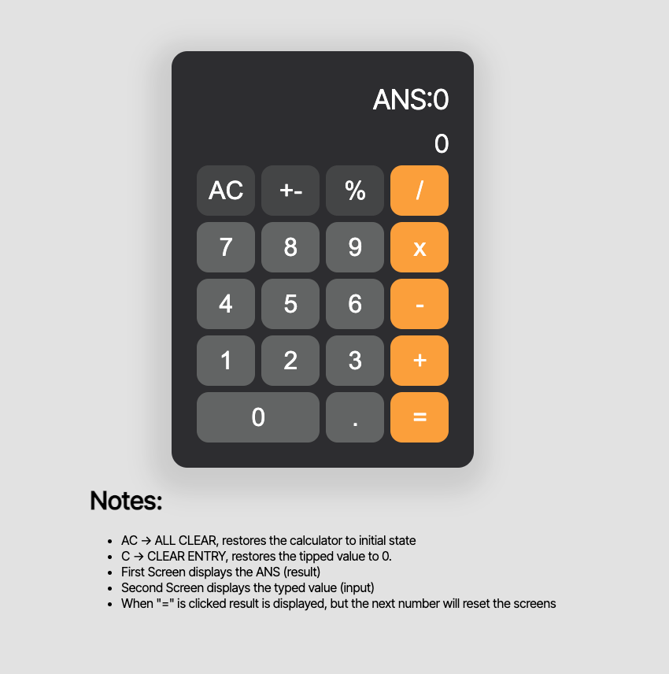

# SIMPLE REACT CALCULATOR

This project was bootstrapped with [Create React App](https://github.com/facebook/create-react-app).

# Application Description

This application was developed for the React Basis Course of the FrontEnd Meta certification. Its purpose is to demonstrate a simple of example of the use of react basic tools to create a minimalist calculator: 

## Available Scripts

In the project directory, you can run:

### `npm install`

It will install all node dependencies to run the project

### `npm start`

Runs the app in the development mode.\
Open [http://localhost:3000](http://localhost:3000) to view it in your browser.

The page will reload when you make changes.\
You may also see any lint errors in the console.

### `npm run build`

Builds the app for production to the `build` folder.\
It correctly bundles React in production mode and optimizes the build for the best performance.

The build is minified and the filenames include the hashes.\
Your app is ready to be deployed!

See the section about [deployment](https://facebook.github.io/create-react-app/docs/deployment) for more information.

